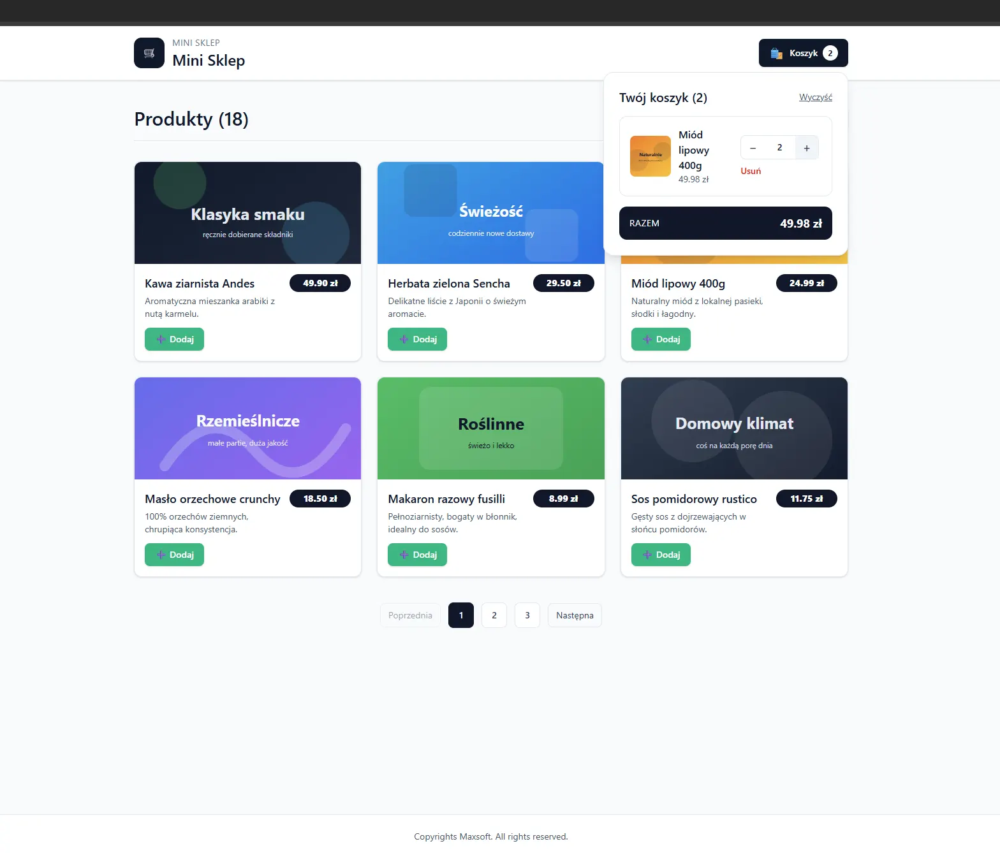

# 🛒 Mini Sklep - Aplikacja Koszyka Zakupów

Aplikacja e-commerce z koszykiem zakupów zbudowana w React z TypeScript. Projekt zawiera pełną funkcjonalność sklepu internetowego z możliwością przeglądania produktów, dodawania ich do koszyka oraz zarządzania zamówieniami.



## 📋 Spis treści

- [Funkcjonalności](#-funkcjonalności)
- [Struktura projektu](#-struktura-projektu)
- [Technologie](#-technologie)
- [Instalacja](#-instalacja)
- [Uruchomienie](#-uruchomienie)
- [Testowanie](#-testowanie)
- [Budowanie](#-budowanie)

## ✨ Funkcjonalności

### Główne funkcje:
- **Przeglądanie produktów** - wyświetlanie listy produktów z paginacją (6 produktów na stronę)
- **Dwa tryby widoku** - siatka (grid) i lista
- **Koszyk zakupów** - dodawanie, usuwanie i modyfikowanie ilości produktów
- **Dropdown koszyka** - wygodne menu z podsumowaniem zamówienia
- **Powiadomienia Toast** - informacje o akcjach użytkownika
- **Responsywny design** - aplikacja działa na wszystkich urządzeniach

### Funkcje koszyka:
- Dodawanie produktów do koszyka
- Zmiana ilości produktów (+/-)
- Usuwanie pojedynczych produktów
- Czyszczenie całego koszyka
- Automatyczne obliczanie sumy zamówienia
- Licznik produktów w koszyku

## 📁 Struktura projektu

```
shopCart_cursor/
├── public/
│   ├── images/          # Obrazy produktów
│   └── products.json    # Dane produktów
├── src/
│   ├── components/      # Komponenty React
│   │   ├── __tests__/   # Testy komponentów
│   │   │   ├── Cart.test.tsx
│   │   │   ├── Footer.test.tsx
│   │   │   ├── Header.test.tsx
│   │   │   ├── Menu.test.tsx
│   │   │   ├── Products.test.tsx
│   │   │   └── Toast.test.tsx
│   │   ├── Cart.tsx          # Komponent koszyka
│   │   ├── Cart.types.ts     # Typy dla koszyka
│   │   ├── Footer.tsx        # Stopka aplikacji
│   │   ├── Header.tsx        # Nagłówek z logo
│   │   ├── Menu.tsx          # Menu z koszykiem (dropdown)
│   │   ├── Products.tsx      # Lista produktów
│   │   └── Toast.tsx         # Powiadomienia
│   ├── __tests__/
│   │   └── App.test.tsx      # Testy głównej aplikacji
│   ├── test/
│   │   └── setup.ts         # Konfiguracja testów
│   ├── App.tsx              # Główny komponent aplikacji
│   ├── main.tsx             # Punkt wejścia aplikacji
│   └── index.css            # Globalne style
├── package.json
├── vite.config.ts           # Konfiguracja Vite
├── tsconfig.json            # Konfiguracja TypeScript
└── README.md
```

### Opis komponentów:

- **App.tsx** - Główny komponent zarządzający stanem aplikacji (produkty, koszyk, toast)
- **Header.tsx** - Nagłówek z logo "Mini Sklep" i integracją Menu
- **Menu.tsx** - Menu górne z przyciskiem koszyka i dropdown
- **Products.tsx** - Komponent wyświetlający listę produktów z paginacją i przełącznikiem widoku
- **Cart.tsx** - Komponent koszyka z listą produktów, kontrolą ilości i sumą
- **Toast.tsx** - Komponent powiadomień wyświetlający komunikaty użytkownikowi
- **Footer.tsx** - Stopka z informacją o prawach autorskich

## 🛠 Technologie

### Główne technologie:
- **React 19.2.0** - Biblioteka do budowy interfejsów użytkownika
- **TypeScript 5.9.3** - Typowany JavaScript
- **Vite 7.2.4** - Narzędzie do budowania i developmentu
- **Tailwind CSS 4.1.17** - Framework CSS do stylowania

### Narzędzia deweloperskie:
- **Vitest 2.1.8** - Framework testowy
- **React Testing Library** - Biblioteka do testowania komponentów React
- **ESLint** - Linter do sprawdzania jakości kodu
- **jsdom** - Środowisko DOM dla testów

## 📦 Instalacja

### Wymagania wstępne:
- Node.js (wersja 18 lub wyższa)
- npm lub yarn

### Kroki instalacji:

1. **Sklonuj repozytorium** (lub pobierz projekt):
   ```bash
   git clone <url-repozytorium>
   cd shopCart_cursor
   ```

2. **Zainstaluj zależności**:
   ```bash
   npm install
   ```

   Lub używając yarn:
   ```bash
   yarn install
   ```

3. **Sprawdź czy instalacja przebiegła pomyślnie**:
   ```bash
   npm run build
   ```

## 🚀 Uruchomienie

### Tryb deweloperski:

Uruchom serwer deweloperski z hot-reload:

```bash
npm run dev
```

Aplikacja będzie dostępna pod adresem: `http://localhost:5173`

### Podgląd produkcyjny:

Aby zobaczyć jak aplikacja wygląda po zbudowaniu:

```bash
npm run build
npm run preview
```

Aplikacja będzie dostępna pod adresem: `http://localhost:4173`

## 🧪 Testowanie

Projekt zawiera kompleksowe testy jednostkowe napisane w React Testing Library.

### Uruchomienie testów:

**Podstawowe uruchomienie testów:**
```bash
npm test
```

**Uruchomienie testów w trybie watch (automatyczne uruchamianie przy zmianach):**
```bash
npm test
```
(Naciśnij `a` aby uruchomić wszystkie testy)

**Uruchomienie testów raz i zakończenie:**
```bash
npm test -- --run
```

**Interfejs graficzny testów:**
```bash
npm run test:ui
```

**Testy z raportem pokrycia:**
```bash
npm run test:coverage
```

### Statystyki testów:

Projekt zawiera **50 testów** pokrywających wszystkie główne komponenty:
- ✅ **Toast** - 4 testy
- ✅ **Cart** - 9 testów
- ✅ **Products** - 12 testów
- ✅ **Header** - 5 testów
- ✅ **Menu** - 8 testów
- ✅ **Footer** - 2 testy
- ✅ **App** - 10 testów

### Przykładowe testy:

Testy sprawdzają:
- Renderowanie komponentów
- Interakcje użytkownika (kliknięcia, wprowadzanie danych)
- Zarządzanie stanem (koszyk, produkty)
- Obsługę błędów i stanów ładowania
- Poprawność wyświetlania danych

## 🏗 Budowanie

Aby zbudować aplikację do produkcji:

```bash
npm run build
```

Zbudowane pliki znajdą się w katalogu `dist/`.

### Weryfikacja builda:

```bash
npm run preview
```

## 📝 Skrypty dostępne w projekcie

| Skrypt | Opis |
|--------|------|
| `npm run dev` | Uruchamia serwer deweloperski |
| `npm run build` | Buduje aplikację do produkcji |
| `npm run preview` | Podgląd zbudowanej aplikacji |
| `npm run lint` | Sprawdza kod za pomocą ESLint |
| `npm test` | Uruchamia testy w trybie watch |
| `npm run test:ui` | Uruchamia interfejs graficzny testów |
| `npm run test:coverage` | Generuje raport pokrycia testów |

## 🎨 Funkcje UI/UX

- **Responsywny design** - aplikacja dostosowuje się do różnych rozmiarów ekranów
- **Smooth transitions** - płynne animacje i przejścia
- **Accessibility** - wsparcie dla czytników ekranu (aria-labels)
- **Modern UI** - nowoczesny design z Tailwind CSS
- **Toast notifications** - przyjazne powiadomienia o akcjach

## 📄 Licencja

Copyrights jako Maxsoft

## 👨‍💻 Autor

**Maxsoft**

---

**Uwaga:** Projekt został stworzony jako przykład aplikacji e-commerce z pełną funkcjonalnością koszyka zakupów. Dane produktów są ładowane z pliku `public/products.json`.
